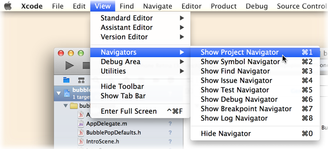
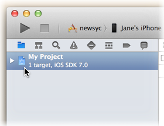
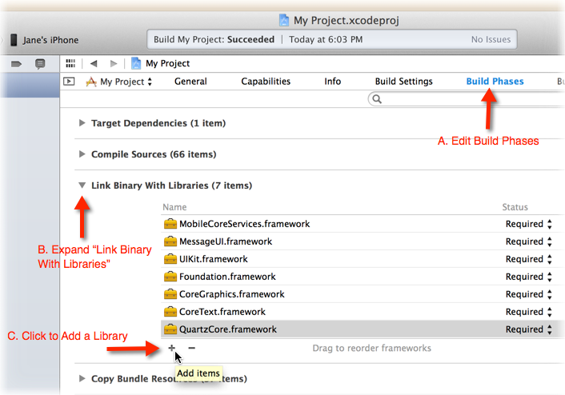
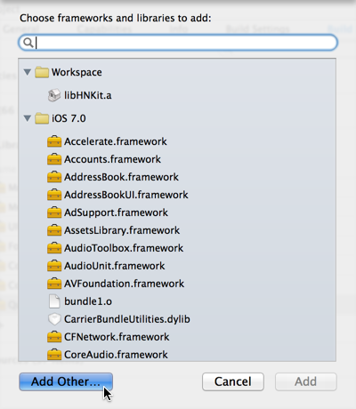
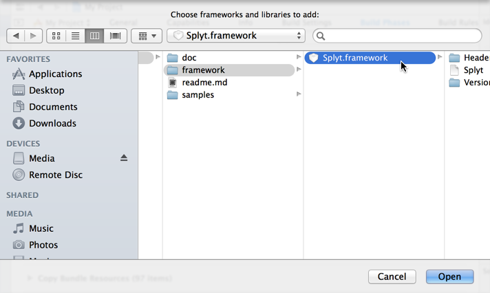

Adding SPLYT to Your Own App
=========

Last Updated: February 10, 2104

The BubblePop sample project included with this SDK was preconfigured to use the SPLYT's iOS framework.

When adding SPLYT to your own app, you will need to add the framework yourself.  The following steps are based on Xcode 5 running on Mac OS X 10.9 Mavericks:

1. Open your Xcode project.
2. Go to Xcode's Project Navigator. If it is not already open, you can open it by clicking the **View | Navigators | Show Project Navigator** menu item.
    
3. In Project Navigator, select the project you opened.
    
4. The project editor will appear.  Click **Build Phases** at the top of the project editor.
5. Expand the **Link Binaries with Libraries** group.
6. Click the **Plus (+)** button under **Link Binaries with Libraries**.
    
7. In the dialog sheet that appears, click the **Add Other...** button.
    
8. In the window that appears, find the directory where you extracted the SDK and navigate to its `framework` subdirectory. Highlight the `Splyt.framework` file and then click **Open**.
    
9. At this point, you should be able to start adding code to your app to send telemetry data to SPLYT.  See our [overview of the SPLYT APIs](md_gettingstarted_gettingstarted.html) for some help getting started, or refer to [our complete API reference](annotated.html).