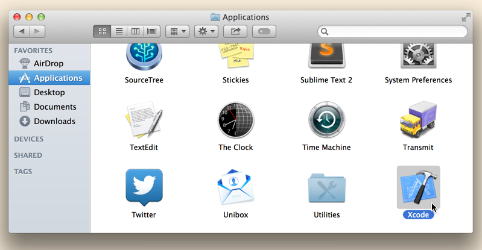
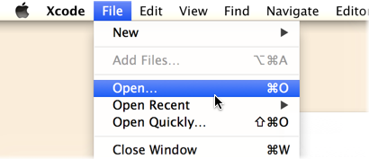
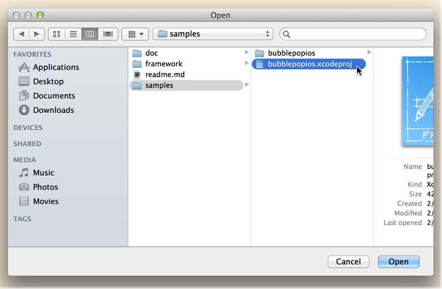
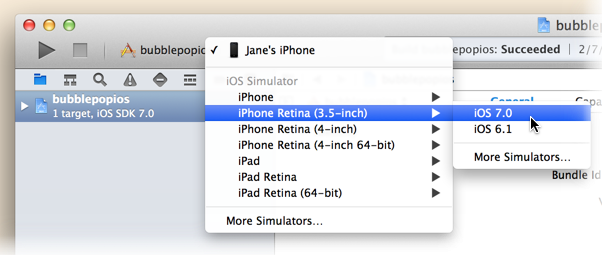
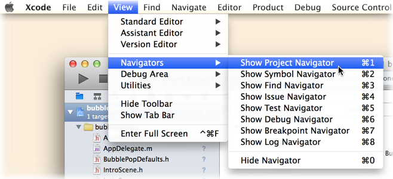
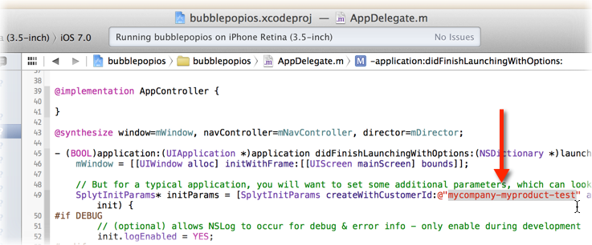
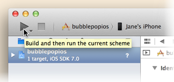
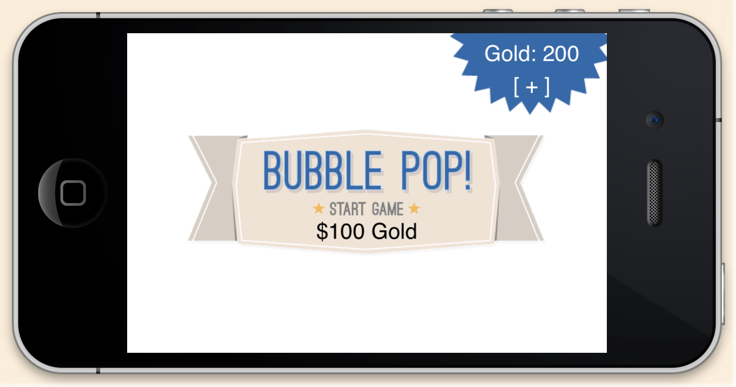

Using the BubblePop Sample
=========

Last Updated: February 10, 2014

## Introduction

The SDK includes a very simple iOS game that exercises some of the features of SPLYT.  This serves as a good starting point for many new users.  By stepping through the sample code, you can see how the SPLYT APIs are called.  Furthermore, you can use our SDK Debugger tool to verify that telemetry sent by these APIs is received by SPLYT.

BubblePop is an extremely simple game that sends data to SPLYT.  In this game: 

* You have a balance of virtual currency, referred to as "gold". 
* To play a game, you need to spend some of your gold.
* In the game, you click on bubbles to pop them.  One of these bubbles is a "winning" bubble.  The goal is to find that bubble before it is the only one left.
* If you win and find the winning bubble before it is the only one left, you are awarded some gold.
* You can also add more gold to your account by making an in-app purchase (don't worry -- in this sample game, you don't actually have to spend money make an in-app purchase!).

Admittedly, this game is not technically impressive; nor is it even all that much fun!  It simply exists to illustrate the steps involved in implementing SPLYT in an app.

The following steps walk you through the process of running the BubblePop sample.  These steps are based on Xcode 5 running on Mac OS X 10.9 Mavericks.

## Opening the Project

1. To get started, open Xcode.  You'll normally find Xcode installed to the `/Applications` folder:
   
2. After Xcode starts, open a new project by selecting **File | Open...**.
   
3. In the window that appears, find the directory where you extracted the SDK and navigate to its `samples` subdirectory.  Highlight the file `bubblepopios.xcodeproj` and then click **Open**.
   
4. After the project opens, look at the Scheme menu near Xcode's workspace toolbar. The selected scheme should be **bubblepopios**.  To the right is the destination device or simulator that you will run the BubblePop sample on.  Click on the destination and choose your desired device or simulator from the list available.
   

&nbsp; <!-- stupidity to satisfy Doxygen formatting -->

## Optional: Setting Your SPLYT Customer ID

To see your events in SPLYT, the game needs to be initialized with your unique customer ID.

Note that you may skip this step and continue to run the sample. However, if you skip this step, the data for BubblePop will not be visible to you in SPLYT's SDK debugger and dashboards.

If you *do* choose to set your customer ID to send BubblePop data to SPLYT, you will only want to send it to your `test` environment.  And if you wish to remove the BubblePop data from SPLYT at a later date, you will need to send a request to the [SPLYT Support Team](mailto:support@splyt.com) to do this for you.  A request to clear the data in your SPLYT `test` environment will result in *all* data being removed, whether it came from the BubblePop sample or your own app.

1. To use your specific customer ID, we'll need to change the code in BubblePop. To open the BubblePop code, go to Xcode's Project Navigator. If it is not already open, you can open it by clicking the **View | Navigators | Show Project Navigator** menu item.
    
2. In the Project Navigator, expand the **bubblepopios** project, and then expand the `bubblepopios` folder shown underneath it. Select the file `AppDelegate.m` to open it in Xcode's editor.
3. Find the method `AppController::application:didFinishLaunchingWithOptions:`.  Inside of that method, find the call to SplytInitParams::createWithCustomerId:andInitBlock:.
4. Change the argument to `createWithCustomerId:` from `splyt-bubblepopunity-test` to your own customer ID.  Be sure to specify the customer ID for your test environment; it should end with the characters `-test` .
    

  > *Note: If you do not have or do not know your SPLYT customer ID, contact [support@splyt.com](support@splyt.com) to get one*.

&nbsp; <!-- stupidity to satisfy Doxygen formatting -->

## Running BubblePop

1. After you've opened the project and made sure it is using the appropriate customer ID, click the **Run** button in the workspace toolbar to compile and link BubblePop.
   
2. After BubblePop builds successfully, Xcode runs it on your selected destination and starts a debugging session.
   

&nbsp; <!-- stupidity to satisfy Doxygen formatting -->

## Using the SDK Debugger Page to View your Data

As BubblePop runs on the device, it will send data to SPLYT about what is happening in the game. If you chose to [set up a valid customer ID for BubblePop](#productid), then you can use SPLYT's SDK Debugger to verify that this data is arriving at SPLYT.  To do this, follow these steps:

1. Open a web browser, navigate to [https://dashboard.splyt.com](https://dashboard.splyt.com), and log into SPLYT.
2. Choose the product [whose customer ID you specified](#productid) when you set up the sample:
    
3. Choose **Tools** from the nav bar on the top right:
    
4.	Once in the Tools section, choose the **Debugger** tool from the nav bar on the left.
5.	As you continue to play the BubblePop game that you started on iOS during the steps above, the SDK Debugger page will periodically refresh and show data that the game is sending to SPLYT.  You can use this to verify that your app is able to talk to SPLYT, and that your instrumentation is correct.
    
    Some tips on how to use this page:
    * All of SPLYT's SDKs send data using an underlying HTTP API.  The event names that appear on this page are based on the HTTP API names, and will differ from the actual SDK method names that you call from your code.
    * The page shows the 25 most recently received events.
    * By clicking on a given event/row, you will see more details.  These details make it easier to match up the data that you see in the debugger with the spot in your code where you called SPLYT to send the data. Click the row again to dismiss these details.
    * If there are any errors in the data that gets sent, they will be highlighted in red.
    * This page shows events received from *all* clients running your app.  It's best to use this page when few clients are running, so that the event stream is more easily interpretable.
    * The controls on the left include a **Play/Pause** toggle and a **Clear** button:
    	* If you toggle the page to **Pause** mode, it will not refresh with new events until you toggle it back to **Play**.  At that point, all events received since the page was paused will be retrieved.
    	* **Clear** permanently removes all events currently shown on the page.
    * This page only works for test environments (i.e., for SPLYT customer IDs ending in `-test`).
6. Data that is received by SPLYT will ultimately be included into all the charts available from the **Visualization** section of SPLYT.  SPLYT processes your data periodically throughout the day.  In general, you should expect your dashboards to update with new data within a couple of hours of the time it was received.

