The SPLYT SDK for iOS
=========
Welcome!  This SDK allows you to integrate your iOS apps with SPLYT, which provides analytics and insights about your app.  In addition, SPLYT empowers you with the ability to take actions that will improve users' engagement with your app.

Adding SPLYT to Your Own App
=========

Last Updated: February 10, 2104

The BubblePop sample project included with this SDK was preconfigured to use the SPLYT's iOS framework.

When adding SPLYT to your own app, you will need to add the framework yourself.  The following steps are based on Xcode 5 running on Mac OS X 10.9 Mavericks:

1. Open your Xcode project.
2. Go to Xcode's Project Navigator. If it is not already open, you can open it by clicking the **View | Navigators | Show Project Navigator** menu item.
    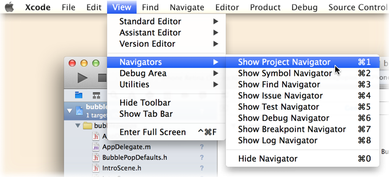
3. In Project Navigator, select the project you opened.
    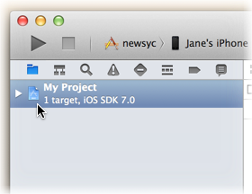
4. The project editor will appear.  Click **Build Phases** at the top of the project editor.
5. Expand the **Link Binaries with Libraries** group.
6. Click the **Plus (+)** button under **Link Binaries with Libraries**.
    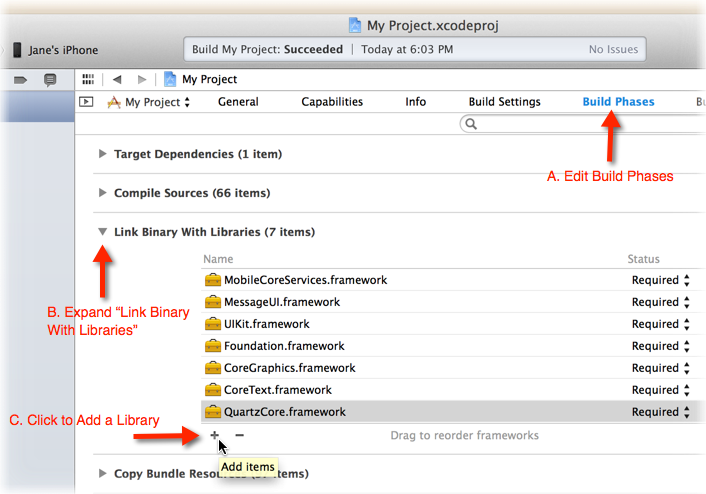
7. In the dialog sheet that appears, click the **Add Other...** button.
    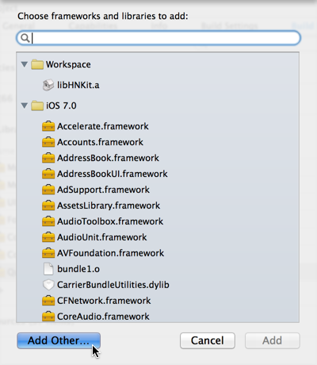
8. In the window that appears, find the directory where you extracted the SDK and navigate to its `framework` subdirectory. Highlight the `Splyt.framework` file and then click **Open**.
    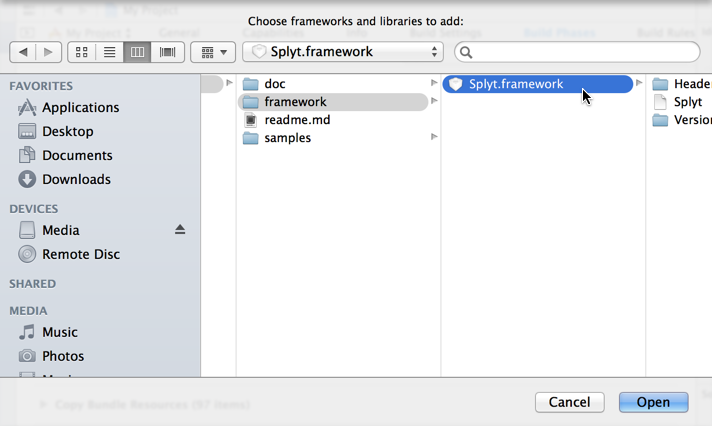
9. At this point, you should be able to start adding code to your app to send telemetry data to SPLYT.

Getting Started
=========

Last Updated: February 10, 2014

## Singleton Instances

Singleton instances of the SPLYT framework classes that you'll use most often are available through the Splyt class:

    [Splyt Core];             // Provides access to the SplytCore singleton
    [Splyt Instrumentation];  // Provides access to the SplytInstrumentation singleton
    [Splyt Tuning];           // Provides access to the SplytTuning singleton
    [SplytPlugins Purchase];  // Provides access to the SplytPurchase singleton
    [SplytPlugins Session];   // Provides access to the SplytSession singleton

See the BubblePop sample in the `samples` subfolder of the SDK for examples of how these singletons get used in an app.

## Initialization
SPLYT initialization should be completed as early as possible in the flow of an application. This allows
telemetry reporting and the usage of SPLYT tuned variables throughout the application.

For iOS apps, the logical spot to initialize SPLYT is often in your app delegate's `application:didFinishLaunchingWithOptions:` method.

Note that the initialization call triggers a callback upon completion, after which point you can reliably use any of the other calls in the SPLYT SDK. Here's an example, passing ::SplytInitParams to SplytCore::init:andThen:

    // contact SPLYT if you do not have a customer ID
    SplytInitParams* initParams = [SplytInitParams createWithCustomerId:@"my-customer-id"
                                                           andInitBlock:^(SplytInitParams *init) {

        // If you have additional information about your user or device to report at startup, you can.
        init.userInfo = myUserInfo;              // See the next section for more about user
        init.deviceInfo = myDeviceInfo;          // and device entities.

    }];

    [[Splyt Core] init:initParams andThen:^(SplytError error) {
        if (SplytError_Success != error) {
            NSLog(@"SPLYT initialization failed with error %ld. Instrumentation and tuning may not work as expected.", (long) error);
        }

        [[[SplytPlugins Session] Transaction] begin];
    }];

### Devices
SPLYT will automatically track some hardware information about your device, but if you have additional (perhaps application-specific) properties to report, you can do so at initialization time.  To do this, use SplytEntityInfo::createDeviceInfo: or SplytEntityInfo::createDeviceInfoWithInitBlock: to create an info object that describes the device, and then use that object as the value of SplytInitParams.deviceInfo :

    SplytInitParams* initParams = [SplytInitParams createWithCustomerId:@"my-customer-id"
                                                           andInitBlock:^(SplytInitParams *init) {

        init.userInfo = [SplytEntityInfo createUserInfo:self.currentUser.id];

        init.deviceInfo = [SplytEntityInfo createDeviceInfoWithInitBlock:^(SplytEntityInfo *device) {
            [device setProperty:@"screen_orientation" withValue:@"landscape"];
            [device setProperty:@"uiwebview_useragent" withValue:[webView stringByEvaluatingJavaScriptFromString:"@navigator.userAgent"]];
        }];
    }];

To report any changes to the state of the device at any later point, see SplytInstrumentation::updateDeviceState:.

### Users
Many applications track individual users with some form of user ID. For such applications, if you know the user ID at startup, it is recommended to set `userInfo` in the callback for SplytCore::init:andThen:.

An example of this can be seen in previous code snippet.  That example uses SplytEntityInfo::createUserInfo: to create a `userInfo` that includes a user ID.

If you have additional user state, you may use SplytEntityInfo::createUserInfo:withInitBlock: together with SplytEntityInfo::setProperty:withValue: or SplytEntityInfo::setProperties: to set up an object that includes that additional state:

    SplytInitParams* initParams = [SplytInitParams createWithCustomerId:@"my-customer-id"
                                                           andInitBlock:^(SplytInitParams *init) {

        init.userInfo = [SplytEntityInfo createUserInfo:self.currentUser.id withInitBlock:^(SplytEntityInfo *user) {
            [user setProperty:@"gender" withValue:@"male"];
            [user setProperty:@"publicProfile" withValue:@"true"];
        }];
    }];

If the user is *not* known at startup, they can be registered at a later point by creating a SplytEntityInfo instance in the same fashion as above and then passing it to SplytCore::registerUser:andThen:

    [[Splyt Core] registerUser:[SplytEntityInfo createUserInfo:self.currentUser.id]
                       andThen:^(SplytError error) {
        // The app may now safely log telemetry and use tuned variables for the user
    }];

Additional notes:

* For applications which allow multiple concurrent users, see SplytCore::setActiveUser:
* For applications which need to support users "logging out", see SplytCore::clearActiveUser:
* To report any changes to the state of the user at any later point, see SplytInstrumentation::updateUserState:

## Telemetry
### Transactions
Transactions are the primary unit of telemetry in SPLYT. Reporting events with a SplytTransaction is simple, but powerful. Consider:

    SplytTransaction* gameTxn = [[Splyt Instrumentation] Transaction:@"play_game"];
    [gameTxn begin];

    // Time passes...

    [gameTxn setProperty:@"something interesting" withValue:@"about the transaction"];
    [gameTxn end];

Note that properties of the transaction may be set at the beginning or end of the transaction, or at any point in between as part of an `updateAtProgress`, but as a best practice, transaction properties should be reported as early as their value is known or known to have changed.

To handle the somewhat common case where a transaction occurs instantaneously, use the SplytTransaction::beginAndEnd method.

Also note that the setting of transaction properties is only persisted after a call to one of the `begin`, `updateAtProgress`, `end`, or `beginAndEnd` methods of SplytTransaction.

### Collections
Collections in SPLYT are an abstraction for anything the user of the application might accumulate or have a varying quantity of. Common examples of this might be virtual currency, number of contacts, or achievements. SplytInstrumentation::updateCollection:toBalance:byAdding:andTreatAsCurrency: can be used at any point where the quantity
of a collection is known to have changed:

    [[Splyt Instrumentation] updateCollection:@"friendCount"
                                    toBalance:@27
                                     byAdding:@-2
                           andTreatAsCurrency:NO];

It is recommended to instrument all of the important collections in the application, as they will add surprising power to your data analysis through contextualization.

### Entity State
As previously mentioned, users and devices (commonly referred to as "entities" in SPLYT) may have their state recorded during initialization, or at a later point in the app by calling SplytInstrumentation::updateUserState: or SplytInstrumentation::updateDeviceState:, respectively. Reporting
changes in entity state is another great way to unlock the power of contextualization.

## Tuning
SPLYT's tuning system provides a means for dynamically altering the behavior of the application, conducting an A/Z test, and creating customized behavior for segments of your user base (targeting).  The instrumentation is very simple, and the hardest part might be deciding what you want to be able to tune. When initialized, SPLYT will retrieve any dynamic tuning for the device or user. At any point thereafter, the application may request a value using SplytTuning::getVar:orDefaultTo:

    // before SPLYT
    NSString *welcomeString = @"Hi there!";
    NSNumber *welcomeDuration = @3.0;

    // with SPLYT tuning variables
    NSString *welcomeString = Tuning.getVar("welcomeString", "Hi there!");
    NSNumber *welcomeDuration = Tuning.getVar("welcomeTime", 3.0);

Note that we specify a default value using the `orDefaultTo` parameter. It is important to provide a "safe" default value to provide reliable behavior in the event that a dynamic value is not available. This also allows for the application to be safely instrumented in advance of any dynamic tuning, targeting, or A/Z test.

In addition to instrumenting key points in your code with SplytTuning::getVar:orDefaultTo:, applications which may remain running for long periods of time are encouraged to utilize SplytTuning::refreshAndThen: in order to make sure that the application has access to the latest tuned values at any point in time. A typical integration point for `refreshAndThen:` on a mobile app might be whenever the application is brought to the foreground, and the code for handling it is quite simple:

    [[Splyt Tuning] refreshAndThen:^(SplytError error) {
        // At this point, tuning for the device and any and all registered users should be refreshed.
    }];

It is not necessary to block for the completion of this call, as is typically recommended for SplytCore::init:andThen:
and SplytCore::registerUser:andThen:, since the application should already have access to viable tuned variables prior to the call to
`refreshAndThen:`.  However, the callback is provided, leaving it to the discretion of the integrator.

## Mobile Apps
For mobile apps, it is likely that the app may come active and inactive many times during it's lifetime. In addition, it is best practice to ensure that applications can function properly under poor network conditions, or even when the device has no network connection. In order to support these characteristics, the SPLYT SDK is designed to protect your telemetry in these situations. However, there's a small bit that needs to be done by the implementor.

When the application is becoming inactive, call SplytCore::pause.  For example, the BubblePop sample does the following from the app delegate's `applicationWillResignActive` method:

    -(void) applicationWillResignActive:(UIApplication *)application {
        [[Splyt Core] pause];

        // other, non-SPLYT code.
    }

And then when it becomes active again, call SplytCore::resume :

    -(void) applicationDidBecomeActive:(UIApplication *)application {
        [[Splyt Core] resume];

        // other, non-SPLYT code.
    }

If necessary, you can still report telemetry while SPLYT is in a paused state, but the telemetry calls may execute more slowly, due to data being read and written from the device's local storage.

Using the BubblePop Sample
=========

Last Updated: February 10, 2014

## Introduction

The SDK includes a very simple iOS game that exercises some of the features of SPLYT.  This serves as a good starting point for many new users.  By stepping through the sample code, you can see how the SPLYT APIs are called.  Furthermore, you can use our SDK Debugger tool to verify that telemetry sent by these APIs is received by SPLYT.

BubblePop is an extremely simple game that sends data to SPLYT.  In this game:

* You have a balance of virtual currency, referred to as "gold".
* To play a game, you need to spend some of your gold.
* In the game, you click on bubbles to pop them.  One of these bubbles is a "winning" bubble.  The goal is to find that bubble before it is the only one left.
* If you win and find the winning bubble before it is the only one left, you are awarded some gold.
* You can also add more gold to your account by making an in-app purchase (don't worry -- in this sample game, you don't actually have to spend money make an in-app purchase!).

Admittedly, this game is not technically impressive; nor is it even all that much fun!  It simply exists to illustrate the steps involved in implementing SPLYT in an app.

The following steps walk you through the process of running the BubblePop sample.  These steps are based on Xcode 5 running on Mac OS X 10.9 Mavericks.

## Opening the Project

1. To get started, open Xcode.  You'll normally find Xcode installed to the `/Applications` folder:
   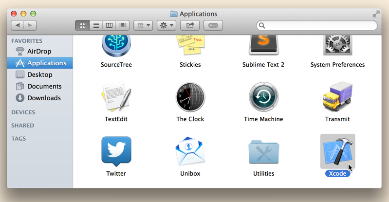
2. After Xcode starts, open a new project by selecting **File | Open...**.
   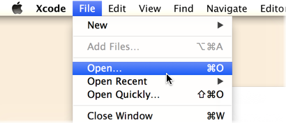
3. In the window that appears, find the directory where you extracted the SDK and navigate to its `samples` subdirectory.  Highlight the file `bubblepopios.xcodeproj` and then click **Open**.
   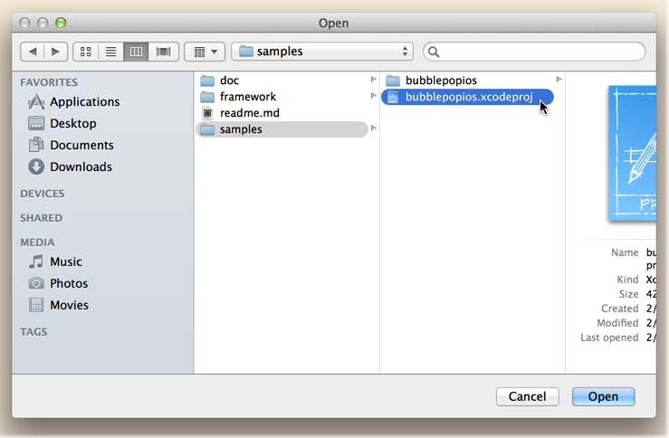
4. After the project opens, look at the Scheme menu near Xcode's workspace toolbar. The selected scheme should be **bubblepopios**.  To the right is the destination device or simulator that you will run the BubblePop sample on.  Click on the destination and choose your desired device or simulator from the list available.
   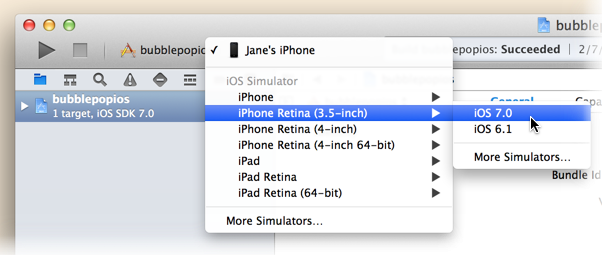

## Optional: Setting Your SPLYT Customer ID

To see your events in SPLYT, the game needs to be initialized with your unique customer ID.

Note that you may skip this step and continue to run the sample. However, if you skip this step, the data for BubblePop will not be visible to you in SPLYT's SDK debugger and dashboards.

If you *do* choose to set your customer ID to send BubblePop data to SPLYT, you will only want to send it to your `test` environment.  And if you wish to remove the BubblePop data from SPLYT at a later date, you will need to send a request to the [SPLYT Support Team](mailto:support@splyt.com) to do this for you.  A request to clear the data in your SPLYT `test` environment will result in *all* data being removed, whether it came from the BubblePop sample or your own app.

1. To use your specific customer ID, we'll need to change the code in BubblePop. To open the BubblePop code, go to Xcode's Project Navigator. If it is not already open, you can open it by clicking the **View | Navigators | Show Project Navigator** menu item.
    
2. In the Project Navigator, expand the **bubblepopios** project, and then expand the `bubblepopios` folder shown underneath it. Select the file `AppDelegate.m` to open it in Xcode's editor.
3. Find the method `AppController::application:didFinishLaunchingWithOptions:`.  Inside of that method, find the call to SplytInitParams::createWithCustomerId:andInitBlock:.
4. Change the argument to `createWithCustomerId:` from `splyt-bubblepopunity-test` to your own customer ID.  Be sure to specify the customer ID for your test environment; it should end with the characters `-test` .
    

  > *Note: If you do not have or do not know your SPLYT customer ID, contact [support@splyt.com](support@splyt.com) to get one*.

## Running BubblePop

1. After you've opened the project and made sure it is using the appropriate customer ID, click the **Run** button in the workspace toolbar to compile and link BubblePop.
   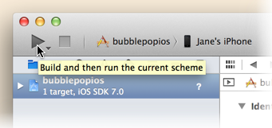
2. After BubblePop builds successfully, Xcode runs it on your selected destination and starts a debugging session.
   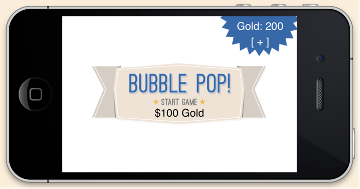

## Using the SDK Debugger Page to View your Data

As BubblePop runs on the device, it will send data to SPLYT about what is happening in the game. If you chose to [set up a valid customer ID for BubblePop](#productid), then you can use SPLYT's SDK Debugger to verify that this data is arriving at SPLYT.  To do this, follow these steps:

1. Open a web browser, navigate to [https://dashboard.splyt.com](https://dashboard.splyt.com), and log into SPLYT.
2. Choose the product [whose customer ID you specified](#productid) when you set up the sample:
    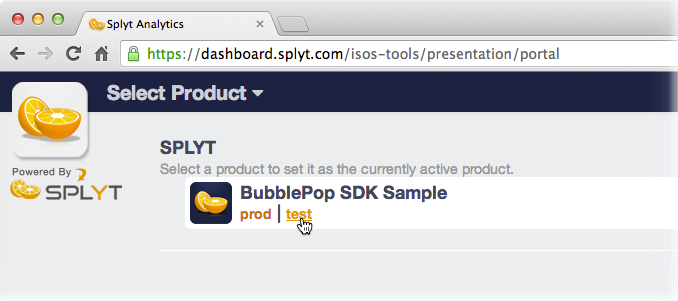
3. Choose **Tools** from the nav bar on the top right:
    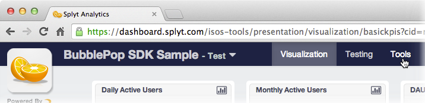
4.  Once in the Tools section, choose the **Debugger** tool from the nav bar on the left. 
5.  As you continue to play the BubblePop game that you started on iOS during the steps above, the SDK Debugger page will periodically refresh and show data that the game is sending to SPLYT.  You can use this to verify that your app is able to talk to SPLYT, and that your instrumentation is correct.
    Some tips on how to use this page:
    * All of SPLYT's SDKs send data using an underlying HTTP API.  The event names that appear on this page are based on the HTTP API names, and will differ from the actual SDK method names that you call from your code.
    * The page shows the 25 most recently received events.
    * By clicking on a given event/row, you will see more details.  These details make it easier to match up the data that you see in the debugger with the spot in your code where you called SPLYT to send the data. Click the row again to dismiss these details.
    * If there are any errors in the data that gets sent, they will be highlighted in red.
    * This page shows events received from *all* clients running your app.  It's best to use this page when few clients are running, so that the event stream is more easily interpretable.
    * The controls on the left include a **Play/Pause** toggle and a **Clear** button:
        * If you toggle the page to **Pause** mode, it will not refresh with new events until you toggle it back to **Play**.  At that point, all events received since the page was paused will be retrieved.
        * **Clear** permanently removes all events currently shown on the page.P
    * This page only works for test environments (i.e., for SPLYT customer IDs ending in `-test`).
6. Data that is received by SPLYT will ultimately be included into all the charts available from the **Visualization** section of SPLYT.  SPLYT processes your data periodically throughout the day.  In general, you should expect your dashboards to update with new data within a couple of hours of the time it was received.

